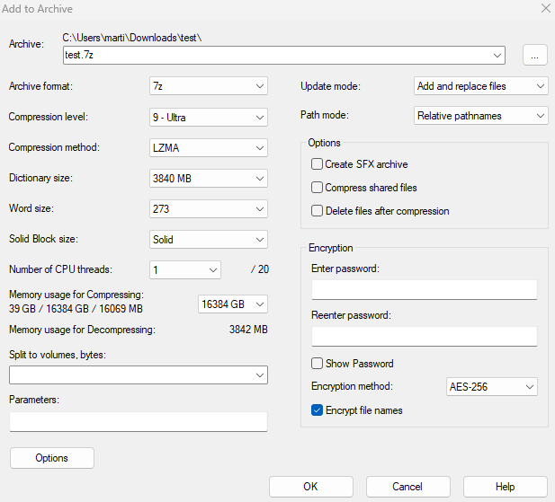
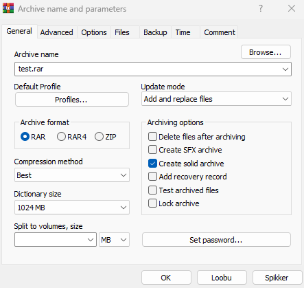

# Awesome archive compressors & optimizers
A list of the awesome archive compressor and optimizer programs.

## Contributing
You're welcome to add additional compressor/optimizer tools and anything by a pull request.

## Table of contents
- [Audio](#audio)
- [Video](#video)
- [Web](#web)
- [Image](#image)
- [Archive](#archive)
- [Mux](#mux)
- [Executable](#executable)

## Audio
*The audio compressors is for use lossless music and speech audio files.*

### Lossless compressors
* [FLAC](https://xiph.org/flac/) - Free Lossless Audio Codec, best for compatability
* [ALAC](https://en.wikipedia.org/wiki/Apple_Lossless_Audio_Codec) - Apple Lossless Audio Codec, best for Apple legacy devices.
* [TAK](http://thbeck.de/Tak/Tak.html) - Tom's Lossless audio Kompressor, best for speed of encode & decode
* [WavPack](https://wavpack.com) - Wave Packer, best for DSD and 32-bit float IEEE
* [OptimFROG](http://losslessaudio.org/) - Optim Frog, best for file size of maximum preset
* [LA](https://web.archive.org/web/20210501091140/http://www.lossless-audio.com/) - Lossless Audio Codec, best alternative to OptimFROG
* [Monkey's Audio](https://monkeysaudio.com/) - Monkey's Audio, best for compression well.
* [MP4-ALS](https://en.wikipedia.org/wiki/Audio_Lossless_Coding) - MPEG-4 Audio Lossless, best for multichannel compression ratio.
* [TTA](http://tausoft.org/wiki/True_Audio_Codec_Overview) - True Audio Lossless, best for ultra low latency.
* [SAC](https://github.com/slmdev/sac) - State of the Art Lossless Codec, best alternative to OptimFROG.
### Physical/hardware media lossless compressors
* [Dolby TrueHD](https://en.wikipedia.org/wiki/Dolby_TrueHD) - Used in Ultra HD Blu-ray releases, but some publishers uses that audio codec.
* [DTS-HD Master Audio](https://en.wikipedia.org/wiki/DTS-HD_Master_Audio) - Most popular for the Bluray releases.
* [Meridian Lossless Packing](https://en.wikipedia.org/wiki/Meridian_Lossless_Packing) - Alternative same as Dolby TrueHD, but it is useful for DVD Audio and HD-DVD.
* [LPCM](https://en.wikipedia.org/wiki/Pulse-code_modulation#Implementations) - Mandatory used in DVD and Blu-ray.
* [WMAL](https://en.wikipedia.org/w/index.php?title=Windows_Media_Audio#Windows_Media_Audio_Lossless) - Windows Media Audio Lossless, best for legacy Windows & Microsoft hardwares.
* [ATRAC3 AL](https://en.wikipedia.org/wiki/ATRAC#ATRAC_Advanced_Lossless) - Adaptive TRansform Acoustic Coding 3 Advanced Lossless, best for legacy Sony product & hardwares.

### Repack compressor of lossy audio files
* [packMP3](http://packjpg.encode.su/?page_id=19) - A compression program for further compressing MP3 audio files (most compatability and FOSS cross-platform)
* [mpz](https://mega.nz/file/f08U0aAC#jPgr1vdMAi8cXYEyiQTXIQeE7bD5jgxuU8tnEYrOzm8) - Sound Slimmer of MP3 repack compressor, but the development ended in 2007 (trialware)
* [OGGRE](https://darckrepacks.com/files/file/262-oggre/) - OGGRE is a vorbis lossless compressor (freeware)

### Optimizers
* [MP3packer](https://wiki.hydrogenaud.io/index.php/MP3packer) - MP3packer is a program which can rearrange the data within an MP3 to fulfill specific goals for reducing 2-10% from CBR to VBR without a loss quality and can rearrange back anytime for CBR or VBR MP3 audio files, but likely optimizer.
* [OptiVorbis](https://github.com/OptiVorbis/OptiVorbis) - Library and application for lossless, format-preserving, two-pass optimization and repair of Vorbis data, reducing its size without altering any audio information.

### Availability & compatability

Compressors | FOSS | Platform | FFmpeg (cross-platform) | MPX DOS
--- | --- | --- | --- | --- |
FLAC | ✔️ | Cross-platform | ✔️ | ✔️
ALAC | ✔️ | Cross-platform | ✔️ | ❌
TAK | ❌ | Windows | ✔️ (decode only) | ❌
WavPack | ✔️ | Cross-platform | ✔️ | ✔️
OptimFROG | ❌ | Windows, Mac, Linux, FreeBSD | ❌ | ❌
LA | ❌ | Windows & Linux | ❌ | ❌
Monkey's Audio | ✔️ | Cross-platform | ⚠️ (maximum 2 channels decode only) | ✔️
WMAL | ❌ | Windows | ⚠️ (partially decode support) | ❌
MPEG-4 ALS | ✔️ | Cross-platform | ✔️ (decode only) | ❌
TTA | ✔️ | Cross-platform | ✔️ | ❌
SAC | ✔️ | Cross-platform | ❌ | ❌
ATRAC3 AL | ❌ | Windows, macOS | ✔️ (decode only) | ❌

**Hardened audio internal program commands:**
```
flac -8ep -r 15 -l 32 --lax -P0 file.wav
takc -e -p4m file.wav
wavpack -x6hh file.wav
ofr --preset max --seek slow file.wav
la -high -noseek file.wav
mac file.wav file.ape -c5000
mp4als -o1023 -a -b -7 -p -MP4 -v file.wav
tta -e file.wav file.tta
sac --encode --sparse-pcm --optimize=high file.wav file.sac
```

**Tips:**

For encoding Dolby TrueHD or MLP in FFmpeg, you can maximize file size to get compression ratio:

```
ffmpeg -i file.wav -c:a truehd -strict -2 -max_interval 128 -lpc_type 3 -codebook_search 100 -prediction_order 4 -lpc_passes 10 file.thd
```

For MLP encoder, change to `-c:a mlp` and make sure the file container is `.mlp`.

It is little bit smaller compression ratio in FFmpeg than encoded TrueHD using Dolby Media Encoder of proprietary encoder software. See the list of file sizes from smallest to biggest.

```
239 123 080 BigBuckBunny-surround.thd // Dolby Media Encoder (TrueHD, used deew in Python from GitHub repository)
242 913 830 BigBuckBunny-surround-10passFF.thd // FFmpeg with 10 pass and hardened
243 021 176 BigBuckBunny-surround-hardened.thd // FFmpeg with hardened only
251 187 000 BigBuckBunny-surround-normal.thd // FFmpeg default TrueHD
343 562 022 BigBuckBunny-Surround.wav // Uncompressed audio file
```

---

For WavPack, you can try add additional command of blocksize to hardened command by example:

```
wavpack -x6hh --blocksize=131072 file.wav
```

Note of WavPack maximum blocksize is 131072. If your audio went compression lower ratio using too big or small blocksize than hardened command without blocksize, try it make less than 100000 or make small or don't add blocksize command.

**For alternative of FLAC optimization:**

You can use [flaccid](https://github.com/chocolate42/flaccid) to minimize your FLAC files as possible from WAV or FLAC, but it takes very longer and slower than normal FLAC program.

`workers` command as **threads**.

FLACCID Hardened command:

```
flaccid --in example.flac --lax --out result.flac --peakset-window 48 --preserve-flac-metadata --queue 16384 --workers 8 --tweak 1 --merge 0 --analysis-apod 'subdivide_tukey(3)' --output-apod 'subdivide_tukey(9)' --analysis-comp mepl32r15 --output-comp mepl32r15 --mode peakset --blocksize-list 64,128,192,256,320,384,448,512,576,640,704,768,832,896,960,1024,1088,1152,1216,1280,1344,1408,1472,1536,1600,1664,1728,1792,1856,1920,1984,2048,2112,2176,2240,2304,2368,2432,2496,2560,2624,2688,2752,2816,2880,2944,3008,3072,3136,3200,3264,3328,3392,3456,3520,3584,3648,3712,3776,3840,3904,3968,4032,4096,4160,4224,4288,4352,4416,4480,4544,4608
```

**FFmpeg hardened commands:**
```
ffmpeg -i file.wav -c:a flac -compression_level 12 -lpc_type cholesky -lpc_passes 8 -exact_rice_parameters 1 file.flac
ffmpeg -i file.wav -c:a wavpack -compression_level 13
ffmpeg -i file.wav -c:a tta file.tta
```

**MP3Packer:**

MP3Packer compresses and rearranges for CBR/VBR MP3 Layer I/II streams, but likely optimizing.

```
mp3packer --copy-time -z constant.mp3
```

**packMP3:**

packMP3 can compress MP3 files with Layer I only

```
packmp3 example.mp3
```

**MPZ:**

mpz can compress MP3 files with any layers and error frames without loss, but it's closed source for Windows available and trialware. The binary file requires MpzSlimmer.dll

Encode (e)/decode (d):
```
mpz e example.mp3 example.mpz
mpz d example.mpz example.mp3
```

Add the lines in Arc.ini
```
[External compressor:mpz]
header    = 0
packcmd   = mpz.exe e $$arcdatafile$$.mp3 $$arcpackedfile$$.mpz
unpackcmd = mpz.exe d $$arcpackedfile$$.mpz $$arcdatafile$$.mp3
datafile = $$arcdatafile$$.mp3
packedfile = $$arcpackedfile$$.mpz
```

Recommended options compress via FreeArc:
```
arc a -m0 MP3MPZ.arc -mmpz example.mp3
```

**OGGRE:**

OGGRE can compress Vorbis streams only, but it's closed source for Windows available and freeware.

It is recommended to use FreeArc for compressing and decompressing.

Please test it to decompress and match MD5 decompressed same as original MD5.

For decompressing, please use cls-oggre.dll in FreeArc.

Add the lines in Arc.ini
```
[External compressor:oggre]
header = 0
packcmd = oggre_enc.exe {options} $$arcdatafile$$.tmp $$arcpackedfile$$.tmp
```
Recommended options compress via FreeArc:
```
arc a -m0 VORBIS.arc -moggre example.ogg
```

## Video
*The video lossless compressors is with video archiver.*

* [AVC](https://en.wikipedia.org/wiki/X264)
* [HEVC](https://en.wikipedia.org/wiki/X265)
* [VVC](https://en.wikipedia.org/wiki/Versatile_Video_Coding)
* [VP9](https://en.wikipedia.org/wiki/VP9)
* [AV1](https://en.wikipedia.org/wiki/AV1)
* [DOSBox](https://dosbox.com)

**AVC:**

Encode lossless video of x264 or FFmpeg:
```
x264 --qp 0 --preset placebo original.y4m -o original.h264
```
```
ffmpeg -i original.y4m -c:v libx264 -preset placebo -crf 0 lossless.mp4
```
**HEVC:**

Encode lossless video:
```
x265 --lossless --preset placebo original.y4m -o original.h265
```
```
ffmpeg -i original.y4m -c:v libx265 -preset placebo -x265-params lossless=1 -crf 0 lossless.mp4
```

**VVC:**

Encode lossless video via Fraunhofer HHI vvenc encoder:

```
vvencffapp --CostMode lossless -i original.y4m --preset slower -b result.266
```

For x266, Multicoreware is releasing x266 encoder soon in H2 2023 (postponed), but future versions will support lossless. Learn more: https://multicorewareinc.com/faq-x266-webinar/

Update about Multicoreware x266 is delayed and postponed with no updates & announcements until it's released.

**VP9:**

Encode lossless video:

```
vpxenc --best --cpu-used=-9 --lossless=1 original.y4m -o result.ivf
```
```
ffmpeg -i original.y4m -c:v libvpx-vp9 -deadline best -cpu-used -8 -lossless 1 -speed -16 -quality best result.ivf
```

**AV1:**

***aomenc is the only one lossless encoder***

Encode lossless video:
```
aomenc -i original.y4m --lossless=1 --cpu-used=3 -o result.ivf
```
```
ffmpeg -i original.y4m -c:v libaom-av1 -aom-params lossless=1 -cpu-used 3 -o result.ivf
```

TIP: If you want also encode lossless alpha video, the only video encoder to use is **Google VP9** or **other lossless video encoders** like (FFV1, UT Video, HuffYUV, QTRLE, FFVHUFF, MagicYUV)

For example libvpx-vp9 alpha lossless video using FFmpeg, add command following:

```
-pix_fmt yuva420p
```

**DOSBox/ZMBV:**

ZMBV (Zip Motion Blocks Video) codec is used to encode DOS display screen about maximum screen size of 640x200 using DOSBox with Stereo channels (16-bit) and unlimited target FPS at your current working screen. Normally it's use of 320x200 DOS screen size, but upscaling will make 2x better quality.

To encode lossless video to ZMBV video codec via FFmpeg:

```
ffmpeg -i sample-dos.avi -c:v zmbv -pix_fmt pal8 result.avi
```

If you screen recording manually in web browsers via archive.org or OBS Studio for example only screen, you can downscale the video, but make sure if you're only downscaling with only DOS Screen:

```
ffmpeg -i recorded-obs.mkv -c:v libx264 -crf 0 -vf cropdetect -s:v 640:200 -sws_flags lanczos+full_chroma_inp output.avi
```

If you're unsure, you can use cropdetect with NULL which is usable static for at all times:

```
ffmpeg -i recorded-obs.mkv -vf cropdetect -f null /dev/null
```

If you're using Windows, replace `/dev/null` by NULL. After that you can insert manually crop command and remove cropdetect filter.

## Web

* [Tidy](https://github.com/htacg/tidy-html5)
* [JSMin](https://github.com/douglascrockford/JSMin)
* [wasm-opt](https://github.com/WebAssembly/binaryen#wasm-opt)
* [ArchiveBox](https://github.com/ArchiveBox/ArchiveBox)

**Tidy:**

Tidy can optimize HTML, CSS and XML.

```
tidy --clean true sample.html > samplemin.html
```

**JSMin:**

JSMin can optimize javascript files:
```
jsmin <example.js >example.min.js
```

**wasm-opt:**

wasm-opt can optimize WebAssembly files:
```
wasm-opt -Oz example.wasm -o example-min.wasm
```

**ArchiveBox:**

You may need to install ArchiveBox as self-hosted web archive server on Docker system image for any OS (recommended) or other installations are available.

Also, you can archive simple using GUI on browser or the command line on your working server machine.

After that, you can archive anything URL links for example web contents, YouTube videos, git codes and more just like Web Archive from Archive.org.

It saves snapshots after website is done archived on local machine and you can access it from local or remote network whenever you like wanted it.

Example from CLI:

```
archivebox add https://martineesmaa.org
```

## Image

* [packJPG](https://github.com/packjpg/packJPG) - A compression program for further compressing JPEG image files
* [Lepton](https://github.com/dropbox/lepton) - Lepton is a tool and file format for losslessly compressing JPEGs by an average of 22%.
* [JPEG-XL](https://github.com/libjxl/libjxl) - JPEG XL image format reference implementation
* [ECT](https://github.com/fhanau/Efficient-Compression-Tool) - Fast and effective C++ file optimizer
* [paq8px](https://github.com/hxim/paq8px) - PAQ8PX compression archiver
* [Scour](https://github.com/scour-project/scour) - An SVG Optimizer / Cleaner
* [gifsicle](https://github.com/kohler/gifsicle) - Create, manipulate, and optimize GIF images and animations

**packJPG:**

packJPG can compress JPG files fast, most compatability and cross-platform for desktop operating systems only.

```
packjpg example.jpg
```

**Lepton:**

Lepton is the Dropbox JPG compressor tool, but the development has deprecated since November 19 2022. Two binaries are lepton default and lepton slow best ratio. On Lepton default, the JPG file is compressed little bigger than packJPG compressed file, but the slow best ratio got little better than packJPG.

```
lepton -skipvalidate example.jpg
lepton-slow-best-ratio -skipvalidate example.jpg
```

**Alternatives to Lepton programming implementation:**

If you're looking for an active project implementation programming language of Lepton, you can use Microsoft's rust code:

https://github.com/microsoft/lepton_jpeg_rust

This is an active repository than original deprecated Dropbox's repository.

**JPEG-XL:**

JPEG-XL can compress JPG and PNG files, even supports animations and lossless/lossy compression. JPEG-XL was implementated to the [supported softwares](https://jpegxl.info/), but due to the cons for Chrome version 110+ removed JPEG-XL and Firefox is only available version of Nightly or Librewolf needs to enable jxl via config. JPEG-XL lossless compression ratio of JPG files got a little bigger file size and memory than packJPG and Lepton, but my best suggestion is for PNG files and the supported programs.

Default command:
```
cjxl -d 0 example.png example.jxl
```

Hardened command:
```
cjxl -d 0 -e 9 -E 11 -g 3 -I 100 example.png example.jxl
```

If you would like to get best file size possible of effort 10, you could add command `--allow_expert_options -e 10`, this could take very slower process and may increase memory usage.

**ect:**

Efficient Compression Tool can optimize JPG and PNG files, command:
```
ect -9 example.jpg
ect -9 example.png
```

Hardened commands:
```
ect -99999 --allfilters-b --pal_sort=120 example.png
```

Note: When optimizing bigger picture resolutions, it may increase CPU and memory usage and all filters & pal sort is only for PNG files.

You could enable `--mt-deflate --mt-file` to speed up process for increasing more CPU and memory usage.

If you're using zip, enable `-zip`.

If you're using g-zip, enable `-gzip`.

Documentation: https://github.com/fhanau/Efficient-Compression-Tool/blob/master/doc/Manual.docx

**paq8px:**

paq8px can compress more better compression ratio using JPEG/PNG/BMP built in model than packJPG, Lepton and JPEG-XL, but it is more slower process than other JPG compressors.

```
paq8px -7ba example.jpg
```

NOTE:

Level 8 and above may not work for 32-bit operating systems and gives out of memory.

Some JPEG files may not detect, which goes back to normal model.

**Scour:**

Scour is the cleaner and optimizer of SVG files.

Normal:
```
scour -i input.svg -o output.svg
```
Better (for older versions of Internet Explorer):
```
scour -i input.svg -o output.svg --enable-viewboxing
```
Maximum scrubbing (hardened):
```
scour -i input.svg -o output.svg --enable-viewboxing --enable-id-stripping \
  --enable-comment-stripping --shorten-ids --indent=none
```

TIP: You could output SVGZ compressed file `-o output.svgz` and optimize using ECT: `ect -99999 -gzip output.svgz` to save file size.

**gifsicle:**

gifsicle can optimize your GIF files.
```
gifsicle example.gif
```

## Archive

* [7-Zip](https://www.7-zip.org/)
* [WinRAR](https://www.win-rar.com/)
* [FreeArc](https://web.archive.org/web/20160124195439/http://freearc.org/)
* [PeaZip](https://peazip.github.io/)
* [paq8px](https://github.com/hxim/paq8px)

**7-Zip:**

You can compress big files to .7z compressed file following by hardened command via CLI:

```
7z a -m0=LZMA -mmt1 -mx9 -md=3840m -mfb=273 -mqs=on output.7z file.txt
```

Note: Some times using p7zip may improve compression ratio better than official version of 7-Zip.

On p7zip version, you may need to remove `-md` argument to avoid invalid error argument of console.

Or even graphical user interface can be seen of this photo:



**WinRAR:**

You can compress using CLI:

```
rar a -m5 -md1024m -s output.rar file.txt
```

or

You can compress using GUI:



## Mux

* [MKVToolNix](https://mkvtoolnix.download)
* [FFmpeg](https://ffmpeg.org)
* [mp4box](https://gpac.wp.imt.fr/)
* [Media file container formats of mux overhead](#media-file-container-formats-of-mux-overhead)

To optimize a little file sizes:

**MKVToolNix:**

Mux one file to matroska container using GUI and command line to remove all metadata, including tags:

```
mkvpropedit file.mkv --tags all: --edit info --set writing-application="" --edit info --set muxing-application="" -d date -d segment-uid
```

**FFmpeg:**

You can remove writing library and metadata:

```
ffmpeg -i example.mp4 -c copy -fflags +bitexact -flags:v +bitexact -flags:a +bitexact -map_metadata -1 example_removed.mp4
```
For AVC, add `-bsf:v "filter_units=remove_types=6"`

For HEVC, add `-x265-params no-info=1`

**mp4box:**

You can remove writing library and metadata:

```
mp4box -itags all=NULL -for-test -add example.h264 -new example.mp4
```

### Media file container formats of mux overhead: ###

To optimize file size by output media container formats of supported video codecs, you need FFmpeg.

**Matroska/MKV:**

All you need is FFmpeg or MKVToolNix to mux into Matroska media container.

Official Matroska of MKVToolnix supports only few video/audio formats, but FFmpeg supports almost all video or audio formats fit to Matroska container format.

For FFmpeg, if you want to disable CRC32 protection to save little bit size, you can use command to apply for it:

```
ffmpeg -i example.mp4 -c copy -write_crc32 false result.mkv
```

Even subtitles were compressed default by zlib on MKVToolNix and FFmpeg.

The best possible small size mux of Matroska is to go FFmpeg.

If you want still get small mux overhead, you can optimize using mkclean.

* [mkclean](https://www.matroska.org/downloads/mkclean.html)

Optimize matroska file using mkclean:

```
mkclean --doctype 2 --optimize example.mkv
```

For this example command, this will use smallest mux overhead to force using Matroska version 2 by adding `--doctype 2`, but you can change to Matroska version 4 as latest by `--doctype 6` on mkclean.

If you would like to get more little bit small mux overhead, you can add `--unsafe` for not output elements like no CRC32 checksums.

This will output into clean.example.mkv without your additional output filename or you can add still output filename.

After that, you can go to [mkvpropedit](#mux) to remove date, writing application and segment UID.

**MPEG-4 Part 14/MP4:**

If you would like to optimize it of MPEG-4, you can use mp4box to optimize more

MP4Box:

```
mp4box -for-test -add sample.mp4 -new optimized.mp4
```

FFmpeg:

```
ffmpeg -i sample.mp4 -c copy -movflags empty_moov -empty_hdlr_name 1 -write_btrt 0 sample-optimized.mp4
```

**Quicktime/MOV:**

Optimize using mp4box:

```
mp4box -for-test -zmov -add sample.mp4 -new sample.mov
```

**Tip for MP4 and MOV containers:**

You can get mux overhead smaller by extracting from any container to raw video & audio files in FFmpeg or MP4Box, after that do in mp4box:

```
ffmpeg -i muxed.mp4 -c copy video.h264
ffmpeg -i muxed.mp4 -c copy audio.aac
```

```
mp4box -raw 1 muxed.mp4 -out video.h264
mp4box -raw 2 muxed.mp4 -out audio.aac
```

```
mp4box -for-test -add video.h264+audio.aac -new optimizedbest.mp4
```

**Note:** mp4box supports only MPEG-4 Part 14 and QuickTime format container for mux & demux.

**Tip:** If you already done muxing video or/and audio using mp4box or FFmpeg, you can use Bento4's mp4compact.

```
mp4compact optimizedbest.mp4 optimizedbest-1.mp4
```

This command converts stsz tables into stz2 tables to create more compact MP4 files, also reduces file size for output after that.

**Windows Media/WMV:**

If you want to optimize file to save little size bit, you need FFmpeg and optimize it:

```
ffmpeg -i Wildlife.wmv -c copy -fflags +bitexact -flags:v +bitexact -flags:a +bitexact -packet_size 24000 Wildlife-copy.wmv
```

.WMA (Audio only) and .ASF are also supported for muxing with copy stream.

If the file container of WMV optimized (no loss quality, only stream copy) went smaller successfully than original WMV, you can try packet size by 65536, 23580, 23999 or other numbers to reduce file size best as possible.

**Audio Video Interleave/AVI**:

To optimize smallest size of AVI file, you can use:

- [AVI Mux GUI](https://www.alexander-noe.com/video/amg/)

- [FFmpeg](https://ffmpeg.org)

AVI Mux GUI gives better to reduce mux overhead than native FFmpeg AVI muxer, but AVI Mux GUI and FFmpeg supports compatible video/audio codecs of AVI container.

## Executable

* [UPX](https://github.com/upx/upx) - the Ultimate Packer for eXecutables
* [Crinkler](https://github.com/runestubbe/Crinkler) - Crinkler is an executable file compressor (or rather, a compressing linker) for compressing small 32-bit Windows demoscene executables.
* [kkrunchy](http://www.farbrausch.de/~fg/kkrunchy/) - kkrunchy is a small exe packer primarily meant for 64k intros. ([source code](https://github.com/farbrausch/fr_public/tree/master/kkrunchy_k7))
* [Leanify](https://github.com/JayXon/Leanify) - Lightweight lossless file minifier/optimizer
* [CompactGUI](https://github.com/IridiumIO/CompactGUI) - Transparently compress active games and programs using Windows 10/11 APIs
* [MSVC](https://visualstudio.microsoft.com/vs/features/cplusplus/) - Microsoft Visual C++
* [GCC](https://gcc.gnu.org/) - the GNU Compiler Collection
* [TCC](https://bellard.org/tcc/) - Tiny C Compiler
* [Clang](https://clang.llvm.org/) - a C language family frontend for LLVM
* [Rust](https://www.rust-lang.org/) - Empowering everyone to build reliable and efficient software.

To compress executable file:

**UPX:**

You can compress using the best method for supported version programs:

```
upx --best --ultra-brute --all-methods example.exe -oexample_shrinked.exe
```

If you would like to compress all icons, add `--compress-icons=3`

See the UPX documentation: https://github.com/upx/upx/blob/devel/doc/upx-doc.txt

**Crinkler:**

Note: This can target .obj files, maximum 8 KB size, C/C++/ASM codes and Windows 32-bit via Visual Studio 2003+ version or Intel C++ Compiler before the final compiles to output a shrinked executable file.

For Visual Studio .NET 2003 version: Use /GA to reduce file size.

For Visual Studio 2005 and later: Use /GS- to reduce file size.

Crinkler normal command:
```
cl /c /O1 /GS- example.c && \
crinkler /ENTRY:main /SUBSYSTEM:CONSOLE example.obj kernel32.lib
```

Crinkler insane command:
```
cl /c /O1 /GS- example.c && \
crinkler /ENTRY:main /NODEFAULTLIB /UNSAFEIMPORT /TINYHEADER /TINYIMPORT /COMPMODE:VERYSLOW /HASHSIZE:1000 /HASHTRIES:100000 /ORDERTRIES:100000 /SUBSYSTEM:CONSOLE /LARGEADDRESSAWARE /TRUNCATEFLOATS /OVERRIDEALIGNMENTS /UNALIGNCODE example.obj kernel32.lib user32.lib
```

See the Crinkler documentation: https://github.com/runestubbe/Crinkler/blob/master/doc/manual.txt

If your code wants to target subsystem Windows, change from CONSOLE to WINDOWS.

For targetting only output EXE file to operating systems using Crinkler for last compatability OS:

Windows 2000: 1.1

Windows XP: 1.3

For running Windows executable files in Wine Linux, this means can't run program well.

**Kkrunchy:**

Kkrunchy can pack the file for executable files for Windows only. Any MSVC builds can pack work, otherwise it won't pack correct for using different build with different compiler than MSVC.

***Please note that the packer may accept smaller than 1 MB to reduce sizes.***

Kkrunchy command:
```
kkrunchy msvc_build.exe --out msvc_build-kk.exe
```

Best command:
```
kkrunchy --best msvc_build.exe --out msvc_build-kk.exe
```

After packing the file, it is no longer decompress back and under Win9X won't run for example old/new MSVC build.

For leanifing kkrunchy compressed program, it is **not recommended** to remove 3.5 KB bytes, it may not work leanified with kkrunchied executable and it's best not to use Leanify.

**Leanify:**

***Please do UPX compress first, before you head to Leanify and test the program***

Leanify can remove only 512 bytes for Windows 32-bit and 64-bit UPX portable executable packed file with MSVC build for removing header after compress. This cannot unpack UPX packed file forever after Leanify shrinked UPX packed file, but it still runs okay.

```
leanify upx_packed.exe
```

**CompactGUI:**

Compact GUI allows you to compress games and softwares on Windows.

Before you compress the game or/and software, please see the reported community compression results of claimed compressed sizes on [here](https://github.com/IridiumIO/CompactGUI/wiki/Community-Compression-Results).

Available of compression:

**XPRESS4K**

**XPRESS8K**

**XPRESS16K**

**LZX**

For the new games or softwares that may require more rams and CPUs, I'd recommend picking XPRESS4K or XPRESS8K, you can pick whenever you like it depending on your computer like old games could be compressed by XPRESS16K or LZX. You can have look for the options description what it said: https://github.com/IridiumIO/CompactGUI#options

**MSVC:**

If you want to compile example C file, command:

```
cl /O1 example.c /link user32.lib
```

**GCC:**

If you want to compile example C file, command:
```
gcc -Os -s -flto example.c
```

**TCC:**

This is likely different than GCC, but it has a little minimum libraries, headers and others. It allows to compile for minimum size than GCC and run the old machines up to Windows 95 and later.

```
tcc example.c -o example
```

**Clang:**

If you want to compile example C file, command:
```
clang -Os example.c
```

**Rust:**

You can add following lines in config.toml:
```
[profile.release]
opt-level = 2
lto = true
```

**TIP:** If you're making a small math calculator in console and it's lower than 4096 MB memory reported in Task Manager/System Monitor, this must be 32-bit build to save up file size than 64-bit build.

If you're making huge like game graphics and more than 4096 MB memory used of compiled program, this must be 64-bit build.

**TIP 2:** Use minimum compiler to compile acceptable codes.

**TIP 3:** Remove dead codes using Cppcheck for C++ codes or Visual Studio.

**TIP 4:** If you have smaller codes of source code and small loops, you can maximize size using `-Os`. If you have bigger codes and loops, you can use favor speed using `-O2` command.

- Martin Eesmaa